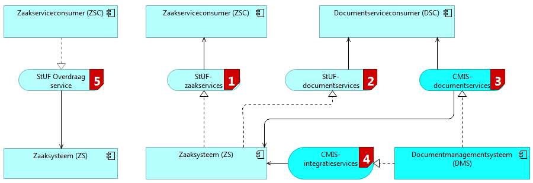

# Techniek Zaak- en Documentservices

De specificatie Zaak- en Documentservices beschrijft vier referentiecomponenten. Dit zijn:

* Zaaksysteem (ZS);
* Documentmanagementsysteem (DMS);
* Zaak service consumer (ZSC, de applicatie die gebruik maakt van de zaakservices) applicatie ;
* Document service consumer (DSC, de applicatie die gebruik maakt van de documentservices) applicatie.

